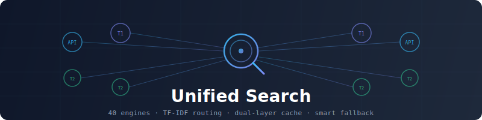

<p align="center">
  
</p>

<h3 align="center">Argo · 阿尔戈</h3>

<p align="center">
  给 Agent 用的统一搜索与证据核验。<br>
  不只返回链接，而是尽量给出<strong>能核验、能吸收</strong>的材料。
</p>

<p align="center">
  <a href="#这是什么">介绍</a> ·
  <a href="#快速开始">快速开始</a> ·
  <a href="#能做什么">能力</a> ·
  <a href="#引擎与路由">引擎</a> ·
  <a href="#使用示例">示例</a> ·
  <a href="#安装与配置">配置</a> ·
  <a href="#版本记录">更新</a>
</p>

<p align="center">
  
  
  
</p>

---

## 这是什么

**Argo 是一套给 AI Agent 用的搜索基础设施。**

你问「贵州茅台股价」，它会优先走东方财富；问「transformer attention paper」，会优先走 arXiv；问「React 和 Vue 怎么选」，会多源召回再合并去重。更重要的是：它会尽量判断**哪些结果值得当真**——是不是搜索结果页壳、有没有数字和披露、多个域名是否说同一件事。

一句话：

> 产出不是「链接清单」，而是「证据候选 + 可信度分解」。

### 和「再包一层搜索 API」的差别

| 常见做法 | Argo |
|---------|------|
| 绑死一个引擎、一个 Key | 多引擎自动选路，免费优先、可配预算 |
| 搜完直接拼摘要 | 选择门槛 × 证据密度 × 时效 × 多源共识 |
| 引擎挂了整条链路挂 | 熔断、负缓存、降级到本地引擎或缓存 |
| 每次查询都重新打网 | 双层缓存（内存 + SQLite），热查询约 10ms 级 |
| 只给链接 | 附带 selection / absorption / 引擎状态等字段 |

### 当前大致能力

- **40+ 引擎**：API / 本地零成本 / 社交 / 金融 / 学术，按意图组合
- **语义路由 + 规则域**：TF-IDF 与正则域配合；低分不再误跳垂直引擎
- **证据两阶段**：Selection（能不能进候选）× Absorption（正文/摘要里有没有可吸收证据）
- **研究与消歧**：`research` 拆子问题、`clarify` 处理歧义、`evidence` 打可信度
- **抓取栈**：HTTP → 浏览器降级，支持聚焦摘录与 PDF
- **MCP 接入**：可直接挂到 Claude / Grok / Kimi 等客户端

```
查询
  │
  ├─ 意图消歧（可选）
  ├─ 路由（域规则 + TF-IDF + 预算模式）
  ├─ 多引擎召回（熔断 / 负缓存 / 并行）
  ├─ RRF 融合 + 可选精排
  ├─ 证据快评（权威 · 证据密度 · 时效 · 共识）
  └─ 统一 JSON（含 engine_outcomes，方便 Agent 判断空结果原因）
```

---

## 为什么需要它

| 痛点 | Argo 的做法 |
|------|------------|
| 中文、金融、学术场景要换来换去 | 自动按域选引擎，东财 / 知乎 / arXiv 等有专线 |
| 摘要里有数，正文对不上 | 高后果场景建议再 `fetch` + `evidence`，不只信 snippet |
| 搜索结果页、跳转链被当成信源 | SERP / 跳转壳识别并降权 |
| 付费额度紧张 | `fast` / `auto` / `deep` / `budget` 四档预算 |
| 重复问题反复等几秒 | 分级 TTL + 柔性命中（条数够可截断复用） |
| 引擎空转白等 | 熔断 + 短 TTL 负缓存，二次调用接近 0ms 跳过 |

---

## 快速开始

```bash
# 克隆
git clone https://github.com/taxueseek/argo.git
cd argo

# 依赖（仅 PyYAML；多数路径用标准库即可）
pip install pyyaml

# 直接搜
python3 scripts/search.py "Python asyncio"

# 金融
python3 scripts/search.py "贵州茅台股价" --json

# 看路由怎么判的
python3 scripts/search.py "transformer attention paper" --explain

# 也可用 CLI 入口（若已配置 bin）
./bin/argo search "查询词" --json
```

不配任何 API Key 也能用：免费引擎 + 本地 `local_*` 引擎会兜底。配了 Key 的引擎质量通常更好，没配则自动跳过。

---

## 能做什么

| 能力 | 说明 | 入口 |
|------|------|------|
| 统一搜索 | 路由 → 召回 → 融合 → 快评 | `search.py` / `argo_search` |
| 深度研究 | 拆子问题、多源采集、缺口提示 | `research.py` / `argo_research` |
| 可信度评估 | 权威 / 证据密度 / 时效 / 交叉验证 | `evidence.py` / `argo_evidence` |
| 意图消歧 | 多义词、品牌碰撞、策略建议 | `clarify.py` / `argo_clarify` |
| 页面抓取 | HTTP 优先，必要时浏览器降级 | `fetch_v3` / `argo_fetch` |
| 站点爬取 / 提取 | 列表页、表格、元数据等 | `crawl` / `extract` |
| 社交与舆情 | 微博 / 小红书 / B 站 / Reddit / X 等 | 社交引擎 / social-sentiment |
| 健康与配额 | 引擎可用性、成本档位 | `health_check` / `quota` |

### 预算模式

| 模式 | 适合 | 行为 |
|------|------|------|
| `fast` | 简单问题、要速度 | 免费引擎优先，跳过付费精排 |
| `auto` | 默认日常 | 成本感知，质量与花费折中 |
| `deep` | 调研、综述 | 质量优先，可多用引擎 |
| `budget` | 额度紧 | 配额控制，用完降级 |

### 证据评分（简版）

```
selection  ≈ 域名权威，SERP/跳转链压到很低
absorption ≈ 数字 / 定义 / 对比 / 披露等证据密度
freshness  ≈ 发布时间（会忽略「2015 年以来」这类历史对比年）
综合       ≈ 0.40·selection + 0.35·absorption + 0.15·freshness + 0.10·引擎分
```

搜索结果里会带 `selection`、`absorption`、`credibility_fast`、`evidence_flags` 等字段，方便 Agent 直接排序，而不必每次再跑一遍完整 evidence。

### Agent 使用纪律（建议）

1. **高后果问题**（持仓、安全、是否属实）：search → 看快评分 → 对 top 结果 `fetch` → 再下结论  
2. **数字**：写清口径，冲突时并列，不要硬合并  
3. **搜索结果页 / 跳转链**：不要当正文信源  
4. **社交帖**：当舆情与叙事，不当事实真值  
5. **事实核查**：宁可多一两条分层查询（来源 / 对比 / 主体）

---

## 引擎与路由

### 直连与垂类（节选）

| 引擎 | 场景 | 成本倾向 |
|------|------|----------|
| anysearch | 通用 / 技术 | 免费 |
| eastmoney | 股票 / 基金 | 免费 |
| zhihu | 中文观点 / 评测 | API |
| arxiv / semantic_scholar / openalex | 学术 | 免费为主 |
| github / stackoverflow | 代码与问答 | 视配置 |
| byted / bocha / metaso | 中文网页 | API / 低成本 |
| tavily / felo | 国际 / 综合 | 付费 |
| exa | 语义检索 | 有额度 |
| wechat_sogou | 公众号检索 | 免费 |
| cls_telegraph / ths_hot / em_global_news | 财经快讯与热点 | 免费 |
| twitter / reddit / xiaohongshu / bilibili / weibo | 社交 UGC | 免费（部分需登录） |

完整列表以 `config.yaml` 与 `--list-engines` 为准。

### 本地零成本层（`local_*`）

不依赖独立的 SearXNG 服务。主路径用进程内 HTML / RSS / JSON 解析（如 `local_bing`、`local_sogou`、`local_arxiv` 等），由路由按语言与主题展开，并参与 RRF 融合。

### 路由怎么选

```
查询
  → 特征（中英比例、是否对比、是否技术词…）
  → 正则域（股价 / 基金 / 学术 / 代码…）
  → TF-IDF 语义分（过低则回退通用引擎，避免误进垂直站）
  → 预算过滤 + 语言补充源
  → engines_combo
```

金融示例仍会进东财；开发文档类不会再因为「零分第一名」误进东财。

---

## 使用示例

### 金融

```bash
$ python3 scripts/search.py "贵州茅台股价" --explain

# 典型：命中 stock_query → 东方财富为主
```

### 学术

```bash
$ python3 scripts/search.py "transformer attention mechanism paper" --json
# domain 常为 academic，引擎组合含 arxiv 等
```

### 研究与核验

```bash
# 深度研究
python3 scripts/research.py "2026 公募基金二季报 持仓结构" --depth deep --json

# 对已有搜索结果打可信度
python3 scripts/search.py "同一查询" --json | \
  python3 scripts/evidence.py "同一查询" --stdin --json
```

### 作为库调用

```python
from search import super_search

result = super_search("Python asyncio", n=5, mode="fast")
for item in result["results"]:
    print(item["title"], item.get("credibility_fast"), item["url"])

# 指定引擎、跳过缓存
result = super_search("黄金价格", engine="eastmoney", n=3, skip_cache=True)
```

### MCP

```bash
python3 scripts/mcp_server.py
```

工具包括：`argo_search`、`argo_research`、`argo_evidence`、`argo_clarify`、`argo_fetch`、`argo_crawl`、`argo_extract`，以及社交相关工具等。以当前 `mcp_server.py` 注册列表为准。

---

## 安装与配置

### 环境

- Python 3.10+
- `pip install pyyaml`
- 无需 Node.js，也无需自建 SearXNG

### API Key（可选）

不配置则跳过对应引擎。请用环境变量，不要把真实 Key 写进仓库。

```bash
export TAVILY_API_KEY="你的密钥"
export BOCHA_API_KEY="你的密钥"
export BRAVE_API_KEY="你的密钥"
export METASO_API_KEY="你的密钥"
export FELO_API_KEY="你的密钥"
export ZHIHU_ACCESS_SECRET="你的密钥"
export GITHUB_TOKEN="你的密钥"          # 可选，提高 GitHub 限频
export WEB_SEARCH_API_KEY="你的密钥"    # 字节搜索等
export ANYSEARCH_API_KEY="你的密钥"     # 可选
```

### 缓存

默认写在用户目录下的 SQLite（路径见 `config.yaml` 的 `cache.db_path`，一般为 `~/.cache/unified-search/cache.db`）。

| 类型 | 大致 TTL |
|------|----------|
| 金融 | 约 5 分钟 |
| 新闻 / 实时 | 约 10–15 分钟 |
| 通用 | 约 1 小时（非时效域可拉长到当日） |
| 研究 / 常青 | 约 2–24 小时 |
| 空结果 | 很短（避免把失败固化成「没结果」） |

缓存键会区分预算模式与搜索深度；请求条数更少时，可用已有更多结果做柔性命中。

---

## 目录结构（简）

```
argo/
├── README.md
├── SKILL.md                 # Agent 技能说明
├── config.yaml              # 引擎与域配置
├── backends/                # 注册表、配额、中文信源表
├── scripts/                 # 搜索 / 路由 / 缓存 / 证据 / MCP …
├── sub-skills/local-search/ # 本地零成本引擎
├── tests/
└── docs/                    # 图示与路线图
```

---

## 设计取舍

1. **先服务 Agent 吸收，再谈链接数量。**  
2. **免费与本地优先，付费可选增强。**  
3. **失败要可观测**：空结果、超时、熔断分开标，不静默吞掉。  
4. **配置驱动扩引擎**，避免每个源写一套不可维护逻辑。  
5. **不把社交当真理库**；X 精确互动排序以平台原生能力为准时，Argo 做扩维与核验更合适。

---

## CLI 常用参数

```
python3 scripts/search.py [选项] 查询词

  --engine, -e       引擎，默认 auto
  --max-results, -n  条数，默认 5
  --depth, -d        fast | balanced | deep
  --mode             fast | auto | deep | budget
  --no-cache         跳过缓存
  --explain          打印路由说明
  --json             JSON 输出
  --timeout, -t      超时秒数
  --list-engines     列出引擎
```

---

## 适用场景

- Claude Code / Grok Build / Codex / Kimi 等 **Agent 的搜索后端**
- 脚本与流水线里需要 **可复现、可缓存** 的检索
- 中文事实核查、金融公开信息、学术与代码资料的 **多源对照**

不太适合单独承担：平台内 X 的高级互动定榜、需要长期养服务的最大召回聚合器（已用内嵌本地引擎替代外挂 SearXNG 主路径）。

---

## 版本记录

| 版本 | 说明 |
|------|------|
| **v2.4.0** | 路由低分回退与社交误吸过滤；缓存 depth / 柔性命中；熔断与负缓存；`engine_outcomes`；RRF 共识源；fetch URL 缓存；介绍页与发布整理 |
| **v2.2–v2.3** | 证据两阶段、中文信源表、content_signals、fetch 栈、引擎扩充、MCP 能力增强 |
| **v2.1** | 社交引擎层（多平台 UGC） |
| **v1.x** | 统一命名为 Argo，多引擎路由与双层缓存成型 |

更细的优化说明见 `docs/OPTIMIZATION_ROADMAP_v2.4.md`。

---

## 贡献

欢迎提 Issue 与 Pull Request。改路由或证据逻辑时，请尽量补对应测试（`tests/`）或跑一遍：

```bash
python3 -m pytest tests/test_unit.py tests/test_evidence_v22.py -q
python3 scripts/ab_eval_p0p1.py   # 可选，含在线实测
```

## License

MIT License © 2026 [taxueseek](https://github.com/taxueseek)

---

> 好的搜索不是让你看得更多，是让你更敢下结论——以及知道什么时候还不该下结论。
